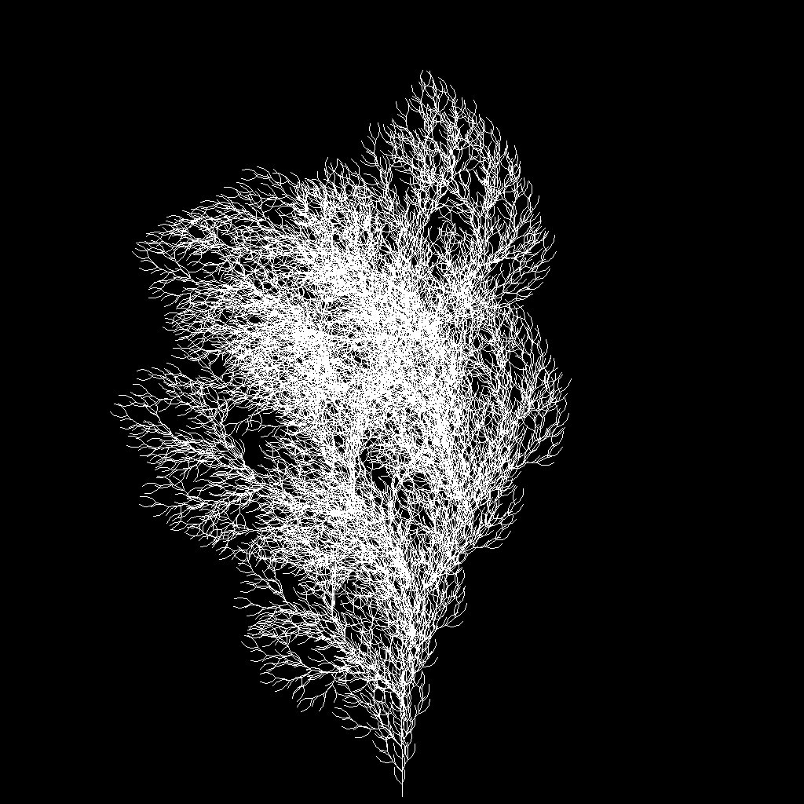

L-System Tree Generator
=======================

#### Usage: 
```
python3 app.py [N] [R] [SIZE] 
```

#### eg. Usage: 
```
python3 app.py 5 8 1024
```

creates 1024x1024px image of 5-th iteration L-System tree with branch length 8

### RULES

Axiom = F

F -> FF+[+F-F-F]-[-F+F+F]

Angle = 25 ± 3° (Random)

### Example:


